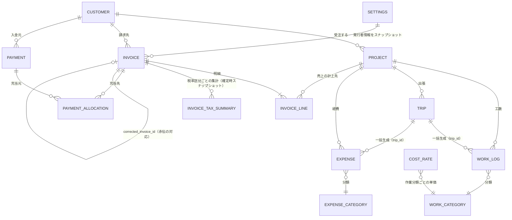
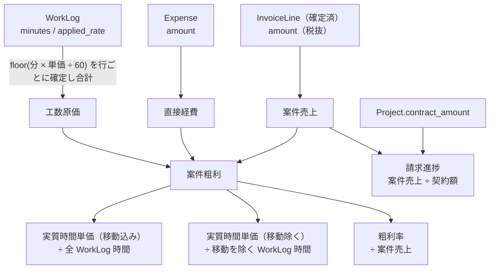
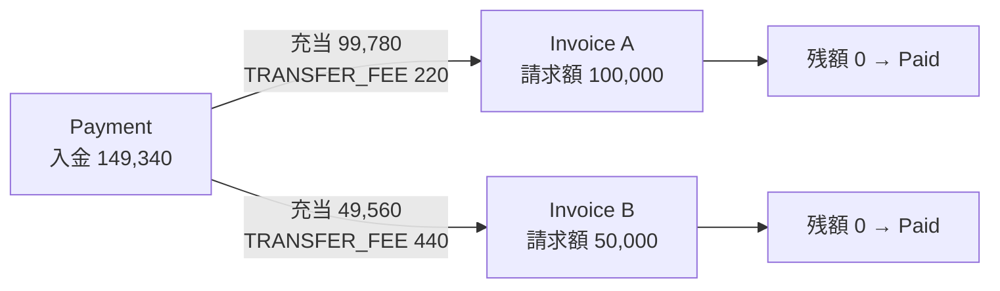

# ER図

`docs/plan.md` 第7章の関連を、Phase 1 の決定（`open-questions.md`）を反映して確定させたもの。

---

## 全体

### この図が表している設計判断

| 判断                               | 図での現れ方                                                               | 根拠                  |
| ---------------------------------- | -------------------------------------------------------------------------- | --------------------- |
| Invoice は Project と 1:1 にしない | `INVOICE` は `CUSTOMER` に属し、`PROJECT` へは `INVOICE_LINE` 経由で繋がる | `CLAUDE.md` 1.3       |
| Payment は Invoice と 1:1 にしない | `PAYMENT_ALLOCATION` を挟んだ N:M                                          | `CLAUDE.md` 1.4       |
| 原価レートは参照しない             | `WORK_LOG` は `COST_RATE` を参照しない（`applied_rate` を行に持つ）        | `CLAUDE.md` 1.2       |
| Trip は生成のまとまり              | `TRIP` から `WORK_LOG` / `EXPENSE` へ 1:N。削除時は `trip_id` を NULL 化   | C-6                   |
| 税集計は確定時スナップショット     | `INVOICE_TAX_SUMMARY` を独立テーブルで保持                                 | `CLAUDE.md` 1.2 / 1.7 |

---

## 採算計算の依存関係

案件採算がどのデータから導出されるかを示す。**Overdue と同じく、採算値はテーブルに保持しない導出値**。

- 実質時間単価は**2種を必ず併記**する（`AGENTS.md` 3.5。片方のみを返す API を作らない）
- 顧客請求対象の経費（`billable = true`）は**原価にも売上にも計上する**（C-4 両建て）

---

## 入金消込の関係

- 1件の入金が複数請求書に分かれる（まとめ入金）／1つの請求書に複数の入金が付く（分割入金）の両方を `PAYMENT_ALLOCATION` で表現する
- 振込手数料の先方差引・源泉徴収は**差額理由コード付きの充当**として記録し、請求額そのものは変更しない
