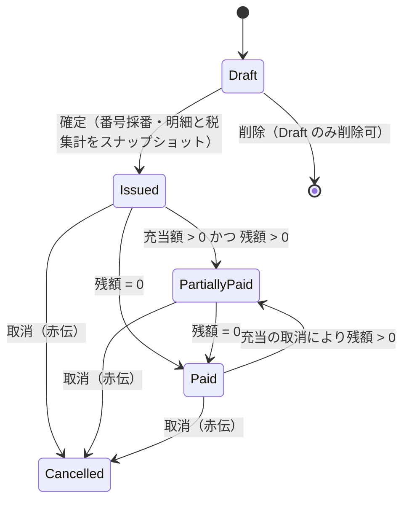
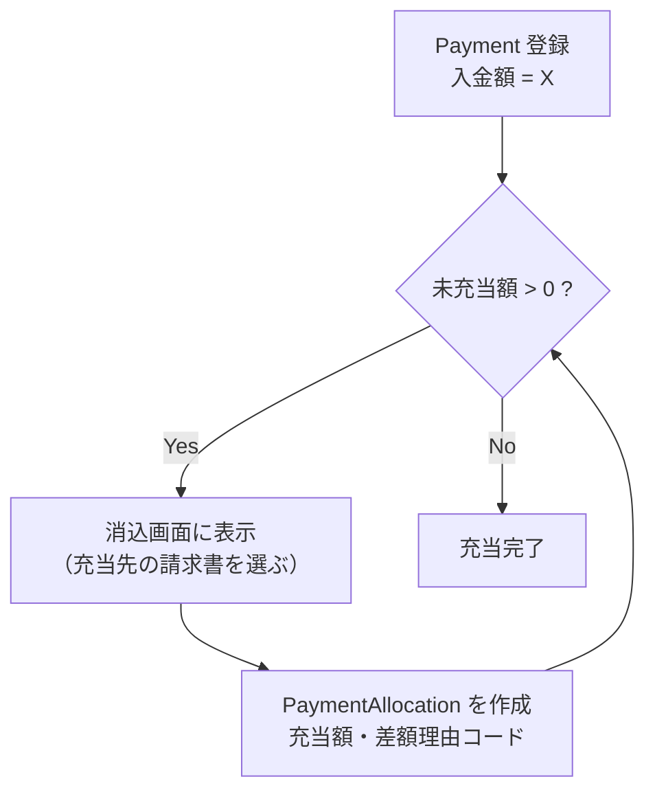
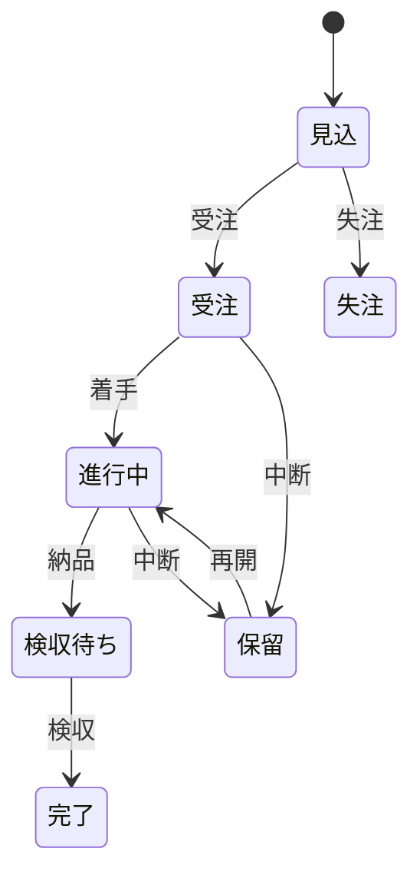

# 状態遷移

Invoice / Payment（消込）/ Project の状態と遷移条件。

---

## 1. Invoice



### 遷移条件

| 遷移                     | 条件・副作用                                                                                                                                                                                        |
| ------------------------ | --------------------------------------------------------------------------------------------------------------------------------------------------------------------------------------------------- |
| `Draft → Issued`         | **請求書番号を採番**（`INV-YYYY-NNNN`、欠番を作らないため確定時に採番）。明細・税率区分ごとの集計・端数処理方向・発行者情報（登録番号等）・支払期限を**スナップショット**する。以降、明細は編集不可 |
| `Issued → PartiallyPaid` | 消込により `充当額合計 > 0` かつ `残額 > 0` になったとき                                                                                                                                            |
| `→ Paid`                 | `残額 = 0` になったとき                                                                                                                                                                             |
| `Paid → PartiallyPaid`   | 誤った消込を取り消して `残額 > 0` に戻ったとき（`Paid` は終端ではない）                                                                                                                             |
| `→ Cancelled`            | 取消（赤伝）。訂正して再発行する場合、**新しい Invoice に `corrected_invoice_id` で元請求書を参照させる**                                                                                           |

### 状態として持たないもの

- **`Overdue`**：`支払期限 < 今日 AND 残額 > 0 AND 状態 ≠ Cancelled` の**導出値**（`CLAUDE.md` 1.5）
- **`Waiting Payment`**：`Issued` に統合（`AGENTS.md` 3.6）

### 状態は保持するか導出するか

`PartiallyPaid` / `Paid` は**消込の結果から導出できる**が、`Draft` / `Issued` / `Cancelled` は導出できない（人の操作）。

**決定：`status` カラムには `Draft` / `Issued` / `Cancelled` のみを保持し、`PartiallyPaid` / `Paid` は残額から導出する。**

```
表示状態 :=
    status = Draft      → Draft
    status = Cancelled  → Cancelled
    status = Issued かつ 残額 = 0            → Paid
    status = Issued かつ 0 < 充当額合計      → PartiallyPaid
    status = Issued かつ 充当額合計 = 0      → Issued
```

理由：入金状態をカラムで持つと、消込の追加・取消のたびに更新が必要になり、`PaymentAllocation` との不整合が起きうる。Overdue を導出値にしたのと同じ理由（`CLAUDE.md` 1.5）。

---

## 2. 入金消込（Payment / PaymentAllocation）

Payment 自体は状態を持たない。**「未充当額が残っているか」で扱いが決まる。**



| 導出値         | 定義                                                                                               |
| -------------- | -------------------------------------------------------------------------------------------------- |
| 入金の未充当額 | `入金額 − その入金の充当額合計`                                                                    |
| 請求書の残額   | `請求額 − その請求書への充当額合計`。**0 未満にはしない**（過入金は `OVERPAYMENT` で記録するのみ） |

### 差額パターン

| パターン             | 記録方法                                                              |
| -------------------- | --------------------------------------------------------------------- |
| 一部入金             | 充当額 < 請求額。残額が残り `PartiallyPaid`                           |
| まとめ入金           | 1つの Payment から複数の Invoice へ `PaymentAllocation` を作る        |
| 振込手数料の先方差引 | 差額分を `TRANSFER_FEE` 理由の充当として記録し、請求額は変更しない    |
| 源泉徴収の先方差引   | 同様に `WITHHOLDING` 理由で記録（自分からは請求書に源泉欄を出さない） |
| 過入金               | 超過分を `OVERPAYMENT` 理由で記録。残額は 0 で止める                  |

---

## 3. Project



| 状態     | 意味                   | 採算集計                               |
| -------- | ---------------------- | -------------------------------------- |
| 見込     | 引き合い・見積提出済み | 対象（工数が発生していれば原価が立つ） |
| 受注     | 受注確定・未着手       | 対象                                   |
| 進行中   | 作業中                 | 対象                                   |
| 検収待ち | 納品済み・検収前       | 対象                                   |
| 完了     | 検収完了               | 対象                                   |
| 失注     | 受注に至らなかった     | **対象外**                             |
| 保留     | 中断中                 | 対象                                   |

- ダッシュボードの「進行中案件」は `受注 / 進行中 / 検収待ち` を指す
- 状態遷移に伴う副作用（自動採番・自動請求など）は持たせない。**状態は記録であって処理のトリガーにしない**
